## 编译顺利但IDE提示一些符号未解决的问题

当前也许还使用Eclipse，尤其使用NDK进行Native支持。在Eclipse里CDT进行c/c++时，尽管编译可能通过，有的可能编译后就好了（也许和发现分析有关）；但往往IDE总会提示未解决的符号，看着不太好。

看[“Unresolved inclusion” error with Eclipse CDT for C standard library headers](http://stackoverflow.com/questions/9337757/unresolved-inclusion-error-with-eclipse-cdt-for-c-standard-library-headers#answer-9337926)
回答指出，Eclipse使用的编译器能识别符号并成功编译，而IDE里提示却不能，是两码事。
> The compiler Eclipse is using is able to resolve the symbols just fine, so the code will compile fine.  
> But the code-completion/preprocessor Eclipse is using doesn't know where stdio.h exists.  
> You need to specify the filesystem path where stdio.h is located.    
> See: http://help.eclipse.org/galileo/index.jsp?topic=/org.eclipse.cdt.doc.user/tasks/cdt_t_proj_paths.htm

看到工程属性里Preprocessor Include Paths, Macros etc.面板里有cannot determine  toolchain提示。Google关键字发现[Indexer support regression](https://code.google.com/p/android/issues/detail?id=33788)。    
其中：8楼指出，只要使用CDT 8.0.2或更早版本，ADT 20.0.1版本就修复了这个问题。但CDT 8.1.0开始改变了索引方式，ADT 20.0.1版本就不行了.也有人指出换成cygwin工具链，目前编译器使用Android的。

50楼指出：
> Its actually pretty easy to fix ( work around ) this issue. Basically
> because of the incompatibility is is only resolving / indexing headers
> for cpp files.
> 
> What we want is to use the Android GCC toolchain but change the actual
> tools and modify the discovery options so that the include paths and
> symbols are correct.
> 
> Go into C/C++ Buid \ Tool Chain editor
> 
> Make sure Android GCC is the selected toolchain and Android Builder is
> the selected builder.
> 
> Click on "Select Tools" Select "Allow all changes" Remove the Android
> GCC Compiler Add "GCC C Compiler" and "GCC C++ Compiler" so that we
> can index both c and cpp headers.
> 
> If you would look at "Paths and Symbols" you would see we have both
> GNU C and GNU C++ languages, but of course the built-in include paths
> are wrong. luckily there is a fix for that.
> 
> Go into C/C++ Build \ Discovery Options Change Discovery profiles
> scope to "Configuration-wide" Make sure the Discovery profile is using
> "AndroidPerProjectProfile" and make sure both checkboxes are checked.
> 
> The ndk include paths should now be correct including include paths
> defined in android.mk files.

这个可以，配个图如下：  
对比Windows的本地c++程序的配置  
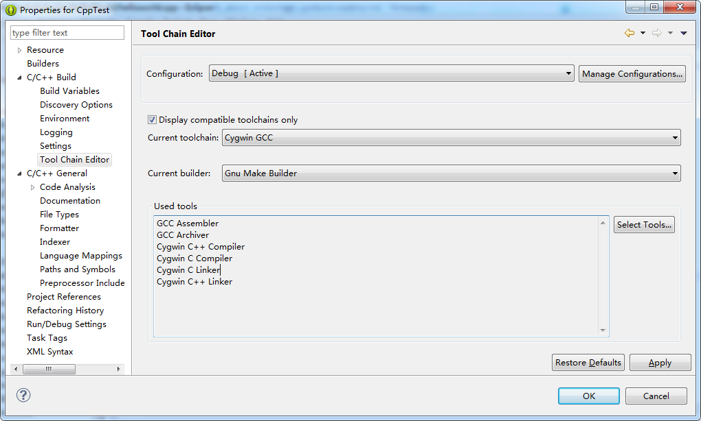
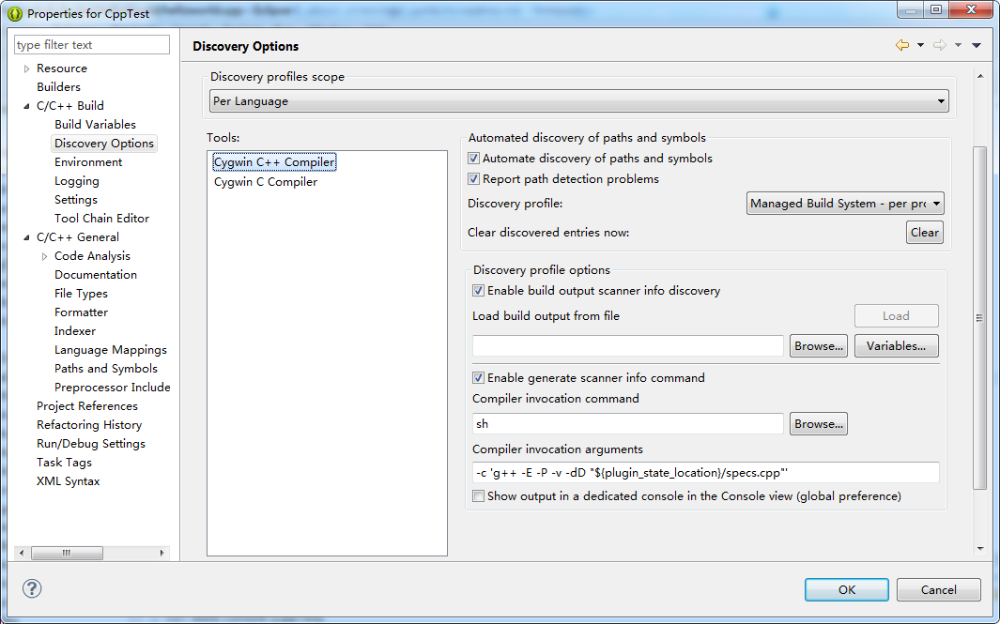
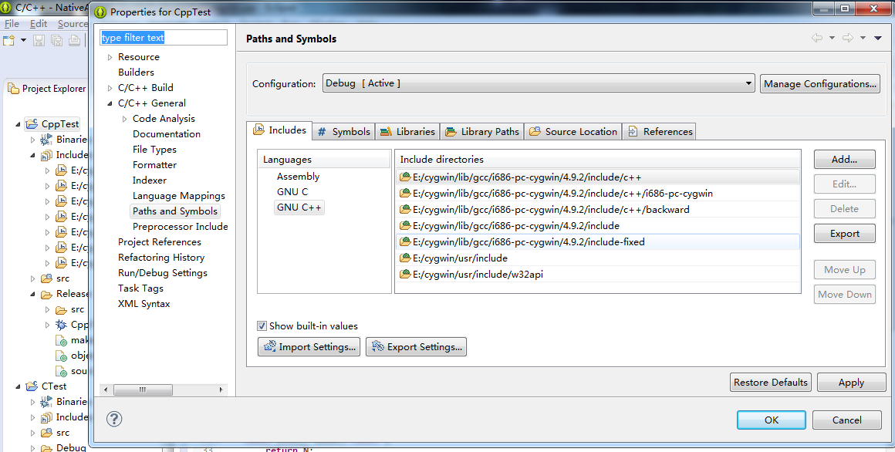
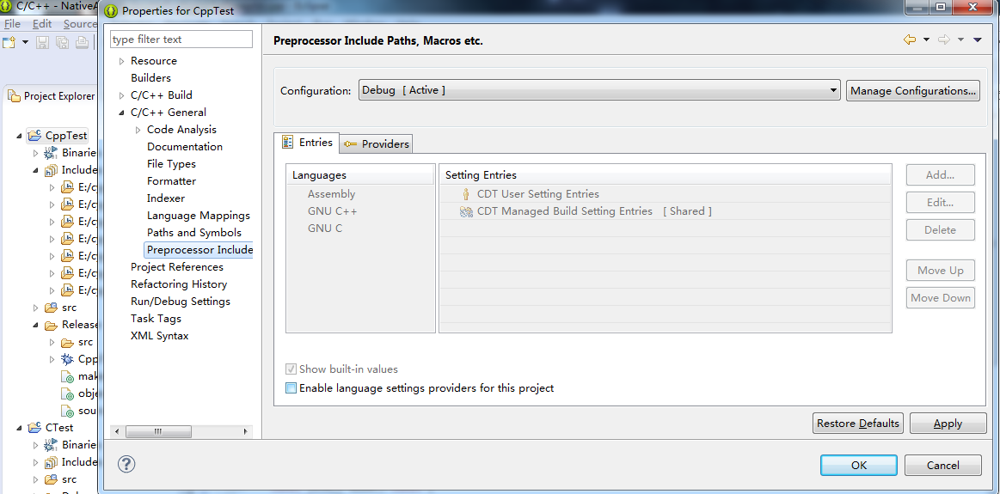  
Android的  
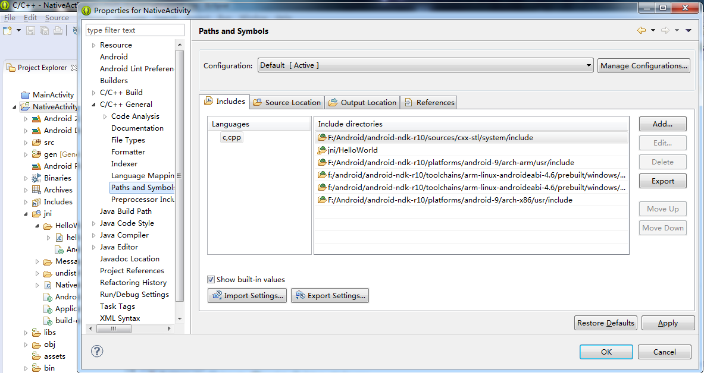
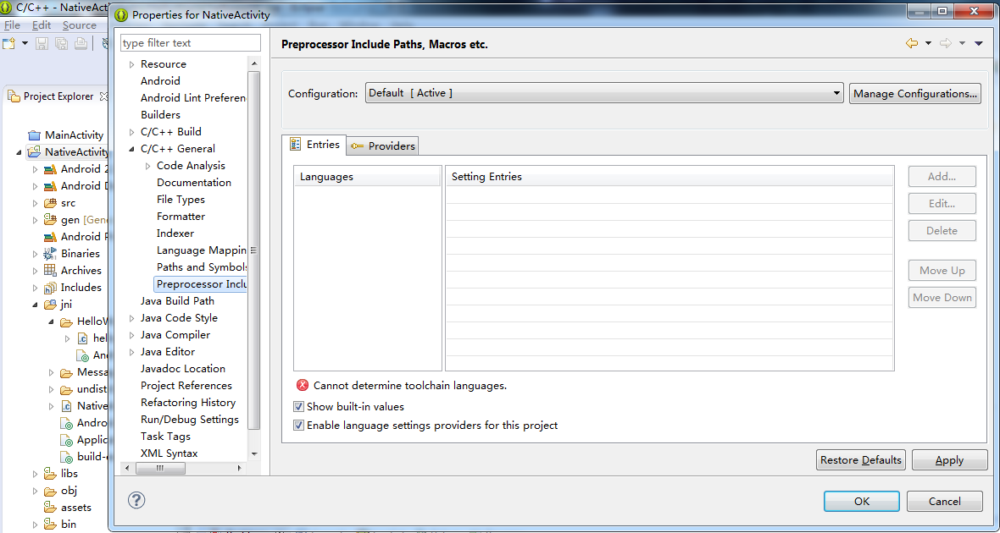
改变一下，将下图  
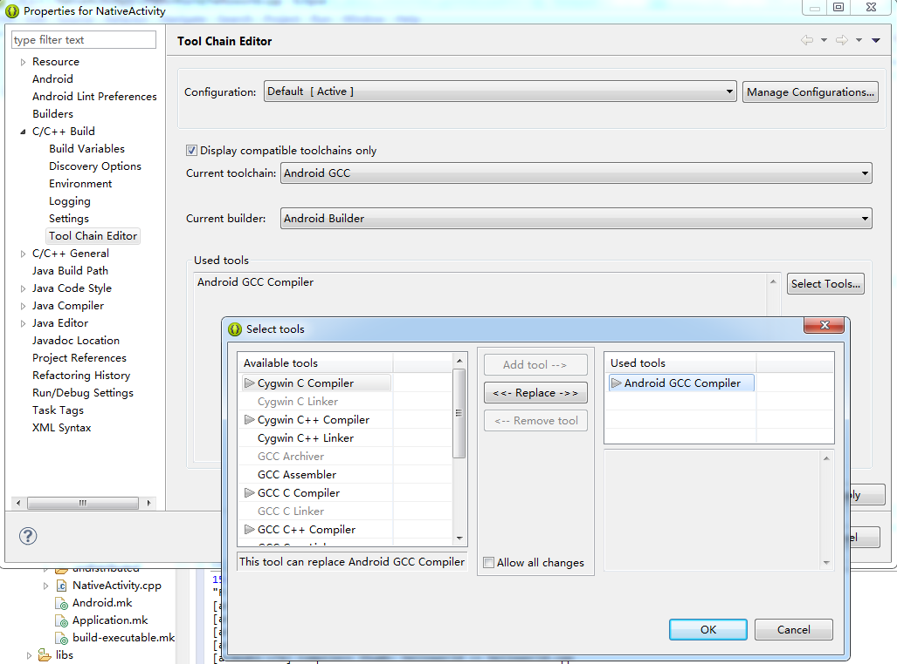
改为下图模样  
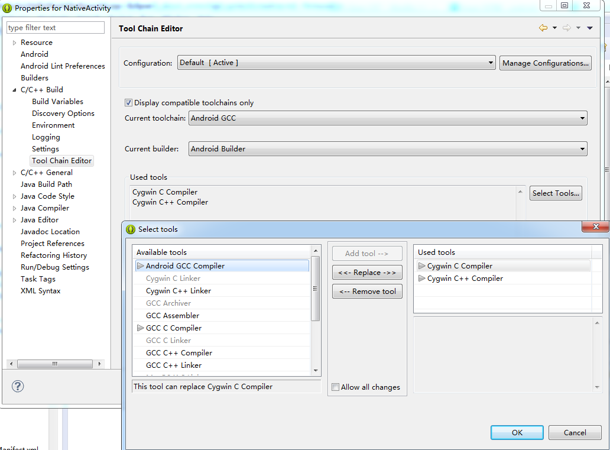  

应用后，Paths And Symbols面板内的内容会变成Cygwin C Compiler和Cygwin C++ Compiler工具链的默认路径了。如下图：  
  
这时要确保发现路径的位置是NDK里的，需要配置一下Discovery Options面板里的选项为 androidPerProjectProfile，这对CDT8.1版本也适用，它会配置好Include等路径的。  
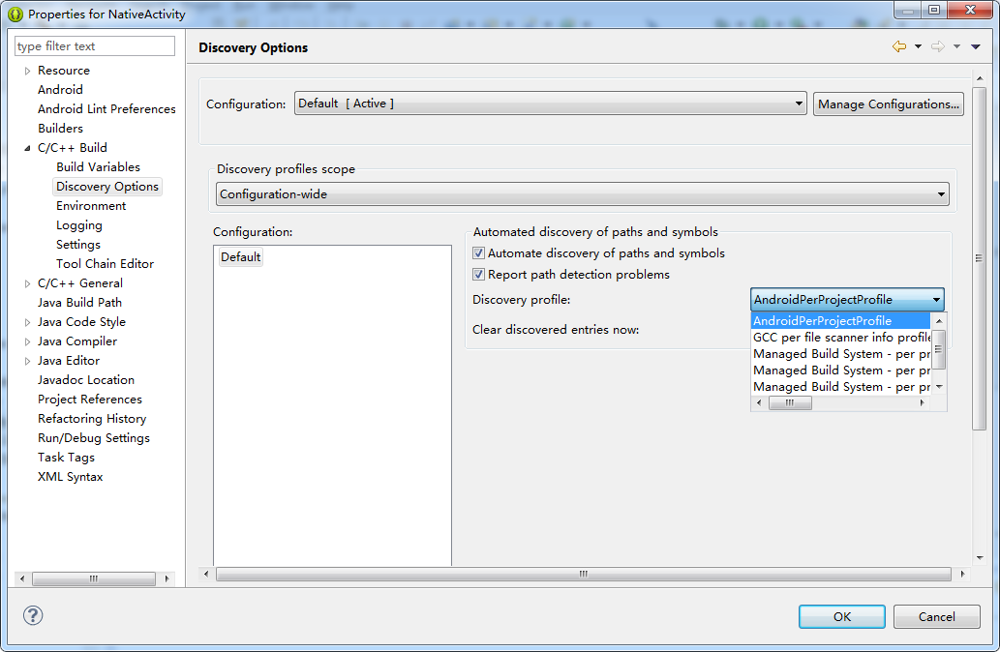  
之后，Paths And Symbols面板里的就好了：  
  
而Preprocessor Include Paths, Macros, etc也呈现良好的结果：  
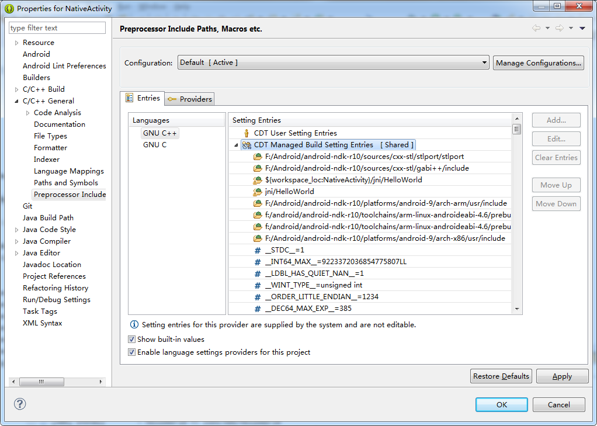

最后也许还需要重建索引：Projects -> C/C++ Index -> Rebuild。如果Include不对还可以通过 Discovery Options 面板（就是选择androidPerProjectProfile的那里）里点击Clear按钮清除。

@see [Eclipse/ADT plugin cannot locate symbols for r10d NDK](https://code.google.com/p/android/issues/detail?id=97023)
指出，r10e可以。


## 附 CDT下载列表 
http://www.eclipse.org/cdt/downloads.php


## Discovery Options vs Preprocessor Include Paths, Macros, etc

我估计原因可能是这个：旧版本CDT的C/C++ Build/Discovery Options被废弃了改用Preprocessor Include Paths, Macros, etc了，所以
androidPerProjectProfile没有用了吗，其内容可能在某处，如https://android.googlesource.com/platform/sdk/+/master/eclipse/plugins/com.android.ide.eclipse.ndk/

官方对于这个新替换文章在这里[Setting Up Include Paths and Macros for C/C++ Indexer](http://www.eclipse.org/community/eclipse_newsletter/2013/october/article4.php)，
指出：
> CDT will try to discover include paths and preprocessor symbols
> automatically for supported tool chains. There are 2 main ways to
> discover those:
> 
> * Built-in Settings. CDT will try to detect built-in compiler symbols and include paths running the compiler with special options and parse
> the output of this special run. Most compilers provide such an option
> to print built-in include paths and symbols. Built-in settings are
> implied and do not get passed to compiler during regular compilation.
> * Build Output Parser (BOP). Another method that CDT employs is to analyze build output of the regular build with Build Output Parser.
> Often, include paths are supplied to the compiler with -I options, and
> macros with -D options and BOP will try to find those in the output.
> That method relies on verbose build output of your build where all
> these options are actually printed by make.

选项可以从下图位置看到：
*注，此图改了"CDT GCC Build Output Parser"一项的属性Compiler command pattern，原来是`(gcc)|([gc]\+\+)|(clang)`
因为有的二进制可能为arm-linux-androideabi-g++。参考[Eclipse CDT](https://developer.mozilla.org/en-US/docs/Mozilla/Developer_guide/Eclipse/Eclipse_CDT#Initial_project_properties)*
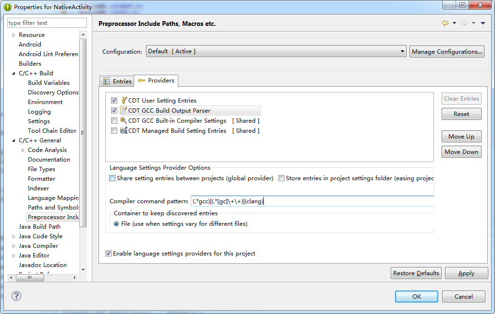

> **Build Output Parser Provider** Build Output Parser Provider parses output of build looking for include paths and macros passed to the
> compiler via compiler options. Include files, macro files passed the
> the compiler and some other compiler options are normally also
> recognized. For gcc, include paths commonly passed with "-I" option
> and macros with "-D" option. The language settings found by BOP are
> available after the build is finished.
> **Builtin Compiler Settings Provider** Builtin Compiler Settings Provider launches the compiler with special options that instruct the
> compiler to print built-in settings such as include paths to internal
> system headers and the list of internally predefined macros. This
> provider is usually shared between projects in workspace and runs in
> background once. When it is finished the language settings are
> available to all the projects between which it is shared.
> **Managed Build Language Settings Provider** MBS Provider supplies language settings provided by Managed Build System.
> **User Language Settings Provider** A user has an opportunity to enter language settings manually using this provider. User Language Settings
> Provider should be normally the first in the list so these settings
> override settings supplied by other providers.
> **Contributed PathEntry Containers** This provider is here for backward compatibility support of PathEntry Containers from older
> versions of CDT. Using this method is not recommended.
> 
>  **Contributed ScannerInfo Entries** This provider is here for backward compatibility support of ScannerInfo Entries from older versions of
> CDT. Using this method is not recommended.


这个不由的要说明一下Eclipse的本地代码的编译，过去（现在已经AndroidStudio了），在Windows上是从cygwin提供环境来交叉编译的，后来NDK直接集成了，配置使用ndk-build编译。默认的ADT支持Native后，就有Android Builder的工具链了，如下图：


而一个编译过程，Eclipse控制台输出如下：
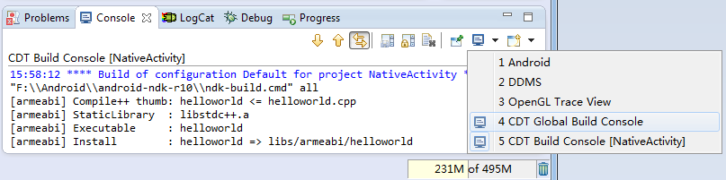
```
15:58:12 **** Build of configuration Default for project NativeActivity ****
"F:\\Android\\android-ndk-r10\\ndk-build.cmd" all 
[armeabi] Compile++ thumb: helloworld <= helloworld.cpp
[armeabi] StaticLibrary  : libstdc++.a
[armeabi] Executable     : helloworld
[armeabi] Install        : helloworld => libs/armeabi/helloworld
```

这里ndk-build.cmd的内容如下：
```mk
@echo off
rem This is a Windows cmd.exe script used to invoke the NDK-specific GNU Make executable
call "%~dp0find-win-host.cmd" NDK_WIN_HOST
if ERRORLEVEL 1 (exit /b 1)
set NDK_ROOT=%~dp0
"%NDK_ROOT%prebuilt/%NDK_WIN_HOST%/bin/make.exe" -f "%NDK_ROOT%build/core/build-local.mk" SHELL=cmd %*
```
首先调用批处理同目录下的find-win-host.cmd获得主机名字，并且会hack传入的%1变量，即NDK_WIN_HOST。这里它要么是windows-x86_64要么是windows。
然后CALL成功exit就调用，设置一个变量NDK_ROOT为批处理所在目录的路径（带有尾斜杠），并执行另一个程序make.exe，通过-f指定一个要读取的makefile文件。

从上面看出，Build Output Parser如何使用make，如何使用g++来分析的，不明。

