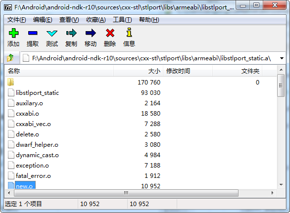

## 使用c++11

C++11特色应该要由编译器和C++库来实现吧，所以配置要点可能如下：

最近 NDK CHANGELOG.md指出，使用Clang而废弃GCC了。

>Changelog
>=========
>GCC
>---
>
> * **GCC in the NDK is now deprecated.**
>     * Time to start using Clang if you haven’t already. If you have problems
>       with Clang, please file bugs!
>     * The NDK will not be upgrading to 5.x, nor will we be accepting
>       non-critical backports.
>     * Maintenance for miscompiles and internal compiler errors in 4.9 will be
>       handled on a case by case basis.
> * GCC 4.8 has been removed. All targets now use GCC 4.9.
> * Synchronized with `google/gcc-4_9` to r224707 (from r214835).


* 配置要点

Application.mk
```mk
NDK_TOOLCHAIN_VERSION := clang

APP_PLATFORM    := android-9
APP_STL         := c++_static
APP_CPPFLAGS    := -fexceptions -frtti
APP_ABI         := all
```
Android.mk
```mk
LOCAL_CFLAGS := -std=c++11
```

`Application.mk`中`APP_STL`配置后就会告诉NDK编译器使用哪个库，不必通过LOCAL_LDLIBS等方式。这个正如`C library`和`An extremely minimal C++ library(libstdc++)`不用`LOCAL_LDLIBS`指定而`Android-specific log support`特色需要在`Android.mk`文件里指名`LOCAL_LDLIBS := -llog`。
```
# include stl headers
# LOCAL_C_INCLUDES += ${NDK_ROOT}/sources/cxx-stl/stlport/stlport
```

* 参考

See [build android with clang instead of gcc ? and the clang stl lib instead of gnustl lib?](http://stackoverflow.com/questions/25970252/build-android-with-clang-instead-of-gcc-and-the-clang-stl-lib-instead-of-gnust)

##使用库的小知识

编译如下代码：
```c++
#include <stddef.h>
#include <stdio.h>

#include <iostream>
#include <functional>
#include <vector>
#include <list>
#include <string>
#include <bitset>
#include <algorithm>    // std::sort

//#include <tuple>

template<class T, const size_t N>
class Array {
private:
	T arr[N];
public:
	T *data() {
		return arr;
	}

	const T *data() const {
		return arr;
	}

	T *end() {
		return arr + N;
	}

	const T *end() const {
		return arr + N;
	}

	T &operator[](ptrdiff_t i) {
		return arr[i];
	}
	const T &operator[](ptrdiff_t i) const {
		return arr[i];
	}

	const size_t size() const {
		return N;
	}
};

int main(int argc, const char *argv[]) {
	Array<char, 2> v2;
	for (size_t i = 0; i < v2.size(); ++i) {
		v2[i] = 65 + i;
	}

	printf("Array<char, %zu> = %.*s\n", v2.size(), v2.size(), v2.data());

	/*
	 A possible output for this program could be:
	 size: 4
	 length: 4
	 capacity: 15
	 max_size: 4294967294
	 */
	std::string str("fang");
	printf("size: %d\n", str.size());
	printf("length: %d\n", str.length());
	printf("capacity: %d\n", str.capacity());
	printf("max_size: %u\n", str.max_size());


	str.append("shanshan");
	printf("find_first_of: %d\n", str.find_first_of("an"));
	printf("find_first_not_of: %d\n", str.find_first_not_of("fang"));

	std::bitset<4> foo;     // foo: 0000
	foo.set();              // foo: 1111
	printf("as an integer is: %lu\n", foo.to_ulong());

//	auto first = std::make_tuple(10, 'a');             // tuple < int, char >
//	const int a = 0;
//	int b[3];                         // decayed types:
//	auto second = std::make_tuple(a, b);               // tuple < int, int* >
//	auto third = std::make_tuple(std::ref(a), "abc"); // tuple < const int&, const char* >
//	printf("third contains: %d and %s\n", std::get < 0 > (third),
//			std::get < 1 > (third));

	std::vector<int> myvector;	// = { 10, 20, 30 };

	myvector.push_back(22);

	//myvector.emplace_back(100);
	//myvector.emplace_back(200);

	printf("myvector contains:");

	for (std::vector<int>::iterator it = myvector.begin(); it != myvector.end();
			++it)
		printf(" %d", *it);
	printf("\n");

	int myints[] = {32,71,12,45,26,80,53,33};
	std::sort (myints, myints+4);

//	for (auto& x : myvector)
//		printf(" %d", x);
	printf("\n");

	std::list<int> mylist;
	printf("mylist.size() = %d, mylist.max_size() = %u\n", mylist.size(),
			mylist.max_size());
	mylist.resize(2);
	printf("after mylist.resize(2)\n");
	printf("mylist.size() = %d, mylist.max_size() = %u\n", mylist.size(),
			mylist.max_size());
	mylist.sort();

	// std::cout << "Hello World\n";
	return 0;
}
```
Android.mk
```mk
LOCAL_PATH := $(call my-dir)

## [^-^] TOOLCHAIN_VERSION = "4.6"
$(info [^-^] TOOLCHAIN_VERSION = "$(TOOLCHAIN_VERSION)")

include $(CLEAR_VARS)
LOCAL_MODULE    := helloworld
LOCAL_SRC_FILES := helloworld.cpp

# FLAGS += -fvisibility=default -fPIE
# LDFLAGS += -rdynamic -fPIE -pie

LOCAL_CPPFLAGS += -std=c++11

# include stl headers
# LOCAL_C_INCLUDES += ${NDK_ROOT}/sources/cxx-stl/stlport/stlport
# for stl port
# LOCAL_LDLIBS    += -lstdc++

include $(BUILD_EXECUTABLE)
```
Application.mk
```
APP_PLATFORM := android-10
APP_ABI = armeabi armeabi-v7a x86  # APP_ABI := all

LOCAL_CPP_FEATURES := # empty exceptions

 #APP_STL := c++_shared # libc++ : c++_static or c++_shared
APP_STL := stlport_static # stlport_static is poor to support c++11, such as std::tuple
APP_STL := gnustl_shared
 # APP_GNUSTL_FORCE_CPP_FEATURES := # empty (enum{ exceptions rtti })
```

* APP_STL := stlport_static时  
libs\armeabi\helloworld      29.3KB  
libs\armeabi-v7a\helloworld  25.3KB  
libs\x86\helloworld          45.4KB  

* APP_STL := stlport_shared时  
libs\armeabi\helloworld					17.2KB  
libs\armeabi\libstlport_shared.so		381KB  
libs\armeabi-v7a\helloworld				17.2KB  
libs\armeabi-v7a\libstlport_shared.so	365KB  
libs\x86\helloworld						9.22KB  
libs\x86\libstlport_shared.so			549KB  

* APP_STL := c++_static时  
libs\armeabi\helloworld				229KB  
libs\armeabi-v7a\helloworld			205KB  
libs\x86\helloworld					57.5KB  
		 
* APP_STL := c++_shared时  
libs\armeabi\helloworld				13.2KB  
libs\armeabi\libc++_shared.so		977KB  
libs\armeabi-v7a\helloworld			13.2KB  
libs\armeabi-v7a\libc++_shared.so	925KB  
libs\x86\helloworld					9.21KB  
libs\x86\libc++_shared.so			1.02MB  
		 
* APP_STL := gnustl_static时  
libs\armeabi\helloworld				169KB  
libs\armeabi-v7a\helloworld			165KB  
libs\x86\helloworld					285KB  

* APP_STL := gnustl_shared时  
libs\armeabi\helloworld					17.2KB  
libs\armeabi\libgnustl_shared.so		637KB  
libs\armeabi-v7a\helloworld				17.2KB  
libs\armeabi-v7a\libgnustl_shared.so	629KB  
libs\x86\helloworld						9.25KB  
libs\x86\libgnustl_shared.so			910KB  

代码中取消注释`std::cout << "Hello World\n";`使用gnustl的就没变化。

* APP_STL := stlport_static时  
libs\armeabi\helloworld      145KB  
libs\armeabi-v7a\helloworld  137KB  
libs\x86\helloworld          249KB  

* APP_STL := c++_static时  
libs\armeabi\helloworld				393KB  
libs\armeabi-v7a\helloworld			361KB  
libs\x86\helloworld					325KB 

* APP_STL := c++_shared时  
libs\armeabi\helloworld				17.2KB  
libs\armeabi\libc++_shared.so		977KB  
libs\armeabi-v7a\helloworld			17.2KB  
libs\armeabi-v7a\libc++_shared.so	925KB  
libs\x86\helloworld					13.2KB  
libs\x86\libc++_shared.so			1.02MB  
		 
由上可知，库作为静态库会把用到的代码编译进目标二进制。静态库就像一个*.o的归档包，估计里面它们之间及符号之间也会有各种依赖吧（此外里面肯定还有其他信息，用于编译，）。要不然上面添加了一句使用std::cout符号的代码，使用有的库目标二进制体积就变大了。

*归档包查看*

ar -t libstlport_static.a列出里面的归档文件，如*.o。
nm libstlport_static.a列出各个归档文件名和其中的符号，结果也许很多。  


*STLport 和 GNU STL 及 LVM libc++不同*

除了[NDK Runtimes and Features](http://developer.android.com/ndk/guides/cpp-support.html#runtimes)列出的特色和[Licensing](http://developer.android.com/ndk/guides/cpp-support.html#li)
STLport是BSD，GNU libstdc++是GPLv3，LLVM libc++是BSD-Like和MIT双许可.

STLport老而小，BSD许可宽松，c++11不支持，不更新了吧；GNU libstdc++支持c++11但大，而且用了就会被感染也要公开代码；LLVM libc++，支持c++11具体看官网http://libcxx.llvm.org/吧。

## 编译器是怎样把库的代码或信息编入目标的

 按照APP_STL引入c++库的方式，引入的库是有源代码，但是也有编译好的二进制文件，如stlport的 libstlport_shared.so 和 libstlport_static.a，可以省去编译库的步骤。Android是使用Android.mk来控制的。
 对于stlport来说，它是（已省略好多内容了）：
```mk
ifneq ($(STLPORT_FORCE_REBUILD),true)

 $(call ndk_log,Using prebuilt STLport libraries)

 include $(CLEAR_VARS)
 LOCAL_MODULE := stlport_static
 include $(PREBUILT_STATIC_LIBRARY)

 include $(CLEAR_VARS)
 LOCAL_MODULE := stlport_shared
 include $(PREBUILT_SHARED_LIBRARY)

else # STLPORT_FORCE_REBUILD == true

  $(call ndk_log,Rebuilding STLport libraries from sources)

  include $(CLEAR_VARS)
  LOCAL_MODULE := stlport_static
  include $(BUILD_STATIC_LIBRARY)

  include $(CLEAR_VARS)
  LOCAL_MODULE := stlport_shared
  include $(BUILD_SHARED_LIBRARY)

endif # STLPORT_FORCE_REBUILD == true
```
 一般库是不需要重新编译的，故走if真条件，即使用预编译好的模块。如果`APP_STL := stlport_static`方式引入则从里面取对应符号的代码，如果`APP_STL := stlport_shared`方式则应该直接拷贝过来（但上面测试貌似不像，大小和下面不一致）
```
 F:\Android\android-ndk-r10\sources\cxx-stl\
 
  llvm-libc++\libs\x86\libc++_shared.so 1.36MB
  llvm-libc++\libs\x86\libc++_static.a  2.19MB
  
  stlport\libs\x86\libstlport_shared.so 755KB
  stlport\libs\x86\libstlport_static.a  1.12MB
``` 
结果就是，stlport_static会长生一个体积大的二进制，stlport_shared会长生两个二进制，即多了一个so文件。而在使用时前者随便用，后者要注意依赖多出的so文件。还有要特别注意这两者在[C++ Library Support](http://developer.android.com/ndk/guides/cpp-support.html)一文的 Static runtimes 和 Shared runtimes 指出的问题。

有一篇讲使用作为静态库的问答
[Link a static library to a shared one during build?](http://stackoverflow.com/questions/14889941/link-a-static-library-to-a-shared-one-during-build)
有回答指出：

> You need --whole-archive linker option in this case to command the
> linker to include whole static libs' content into the shared lib.
> 
> `g++ -shared samlpe.o -o libSample.so -Wl,-whole-archive -lmylib1.a
> -lmylib2.a -Wl,-no-whole-archive`
> 
> From `man ld`:
> 
> > For each archive mentioned on the command line after the
> > --whole-archive option, include every object file in the archive in the link, rather than searching the archive for the required object
> > files. This is normally used to turn an archive file into a shared
> > library, forcing every object to be included in the resulting shared
> > library. This option may be used more than once.
> > 
> > Two notes when using this option from gcc: First, gcc doesn't know
> > about this option, so you have to use -Wl,-whole-archive. Second,
> > don't forget to use -Wl,-no-whole-archive after your list of archives,
> > because gcc will add its own list of archives to your link and you may
> > not want this flag to affect those as well.

